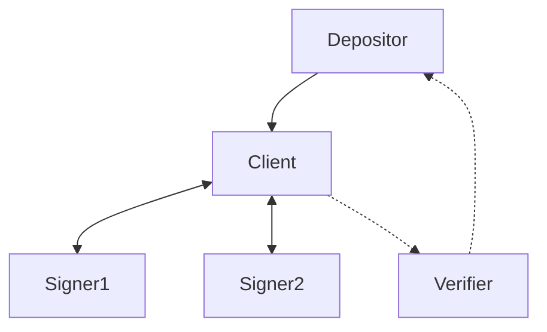

# Outsourcing ephemeral signatures with blinded signature aggregation

## Abstract
We introduce a blinded multi-signature scheme based on Schnorr signatures, that
together with ephemeral keys forms a practical way for using presigned
transactions to safely create vaults or other pre-determined transcation
graphs.

## Introduction

Vaults are a much sought after feature in Bitcoin that many believe finally
would make safe self-custody practical for the regular Joe.

A construction that is possible on Bitcoin today is using pre-signed
transactions to emulate vault-like behaviour[1]. The construction relies on
using ephemeral keys to sign a predetermined transaction graph, before deleting
the keys. However, as detailed in [2], the setup is brittle and presents
several complexities. The most important drawback is that key deletion cannot
be proved, and one is susceptible to malicious software or hardware leaking the
ephemeral key. Ways to mitigate this problem has been devised, but they often
involve complex and expensive infrastructure, hardware and software[citation].

A second drawback is that the amount to deposit to a pre-signed vault is static,
and one risk money getting stuck if the deposit transaction is not exactly as
assumed, or the vault address is reused.

In this post we aim to mitigate these two problems in using pre-signed
transaction graphs, by outsourcing the ephemeral signing to semi-trusted
signing servers, eliminating any single points of failure by having them engage
in a blinded multi-signature scheme. 

PSBTs play a key role in ensuring the correcteness of the deposit transaction,
ensuring that the scheme is practically usable without introducing complex
software requirements for the user.

## Setup
The protocol will involve these actors:
- **Depositor**: the software or hardware entity controlling the keys to the coins
  that are to be deposited into the pre-signed transaction graph. 
- **Client**: the aggregation software that is responsible for building the
  transaction graph, communicating with the signers and deriving blinding
  factors.
- **Signer**: Semi-trusted software agent that will blindly sign a single message
  sent by the client using an ephemeral key. It also has a well-known static
  public key, that will be used to attest to having followed the protocol
  according to the rules.
- **Verifier**: Offline device that will verify the transcript of the protocol,
  ensuring the transaction graph and signatures are valid, and that the
  messages signed are attestated by the signers' well-known keys.

## High-level protocol overview
With a blinded signing scheme in place we can build a safe and practical vault
implementation by passing PSBTs around.

1. The depositor creates a PSBT specifying inputs for the deposit transaction,
   as well as the amount for the vault output and any change outputs.

2. The PSBT is sent to the client which sets up signing sessions with the
   signers.

3. Using the ephemeral public keys of the signers, the client creates the
   aggregate public key that funds will be sent to. 

4. The client builds the transaction that will spend from the aggragate public
   key. Note that it will recursively open more signing session with the
   signers to build the full transaction graph, since each key is good for only
   a single signature.

5. With the transaction created, the client sends a blinded variant of it to
   the signers.

6. Each signer will respond with a single signature using the ephemeral key, as
   well as an attestation to the received blinded information using their
   static key.

7. The verifier is given the information from the signing process from the
   client, verifying that all went according to the protocol.

8. The depositor receives the final PSBT with the vault output key filled and
   the pre-signed transaction graph from the client, and a goahead from the
   verifiers, promting it to sign and broadcast the deposit.

## Goals
Our aim is to set up the protocol with the following goals in mind:

1. As long as at least one of the signers are following the protocol, the other
   actors in the setup cannot collaborate to create valid signatures for any
   other transactions spending from the vaulted output.
2. Malicious client software cannot choose parameters in a way that makes it
   possible to create additional signatures or build transaction graphs unknown
   to the verifier.
3. As long as at least one of the verifiers are honest, we will detect a
   misbehaving client and abort the protocol before depositing funds.
4. The signers won't learn anything about the transactions they are signing,
   how many other signers there are, nor anything about their individual public
   keys or aggregate public key.

# Blinded multi-signature protocol

### Notes on blinded MuSig in the general, non-ephemeral setting 
An open reserch question is whether blinded MuSig1 and MuSig2 can be secure in
a concurrent setting, where a signer potentially can sign multiple messages in
parallel using the same key [citation].

However, in our setup the key and nonces are derived uniformly at random during
protocol initialisation, and deleted immediately after a single signature has
been made. This makes the protocol significantly easier to analyze.

## Ephemeral blinded signing using simplified MuSig2
We base our scheme on MuSig2, but we can simplify it quite a bit since we are
not reusing keys, and operating in a sequential setting.

We'll have two signers take part, but it could easily be generalized to $N$
signers.

The client asks the signers for keys and nonces.

The signers choose one nonce each $R_1 = r_1 * G$ and $R_2 = r_2 * G$. Public
keys are $X_1 = x_1 * G$ and $X_2 = x_2 * G$.

The client uses all the signers' public values to generate the MuSig2 factors
that each signer would create in the regular MuSig2 protocol:

$$
\begin{aligned}
l = H(X_1|X_2) \\
c_1 = H(l|X_1) \\
c_2 = H(l|X_2) \\
X'_1 = c_1 * X_1 \\
X'_2 = c_2 * X_2 \\
\end{aligned}
$$

Aggregate public key: 

$$
X' = X'_1 + X'_2
$$

Aggregate nonce:

$$
R = R_1 + R_2 \\
$$

Note that we only need a single nonce per signer, since we are operating in a
sequential setting.

Client generates blinding values $\alpha_1, \beta_1, \alpha_2, \beta_2$, and
calculates blinded signing nonce:

$$
R' = R + (\alpha_1 + \alpha_2) * G + (\beta_1 * c_1 * X_1) + (\beta_2 * c_2 * X_2)
$$

The clent constructs message $e$ for signing, where $tx$ is the
sighash of the spending transaction to the vaulted output:

$$
e = H(R', X', tx)
$$

The client now blinds the message for each signer, to ensure they don't learn
anything about the transaction they are signing:

$e_1 = e + \beta_1$ and $e_2 = e + \beta_2$.

$e'_1 = e_1 * c_1$ is sent to signer 1.

$e'_2 = e_2 * c_2$ is sent to signer 2.

The signers can now sign:

$$
\begin{aligned}
s'_1 &= r_1 + e'_1 * x_1 \\
    &= r_1 + e * c_1 * x_1 + \beta_1 * c_1 * x_1\\
s'_2 &= r_2 + e'_2 * x_2 \\
    &= r_2 + e * c_2 * x_2 + \beta_2 * c_2 * x_2
\end{aligned}
$$

In addition each signer signs their public values and the values received from
the client using their static key $P_i$. They will delete the ephemeral private
keys after signing:

$$
\begin{aligned}
a_1 = H(R_1||X_1||e'_1) \\
a_2 = H(R_2||X_2||e'_2)
\end{aligned}
$$

$(Y_i,t_i)$ is a signature for message $a_i$ using key $P_i$.

Client unblinds every partial signature:

$$
\begin{aligned}
s_1 = s'_1 + \alpha_1 \\
s_2 = s'_2 + \alpha_2
\end{aligned}
$$

Aggregate signature:

$$
\begin{aligned}
s   &= s_1 + s_2 \\
s   &= s'_1 + \alpha_1 + s'_2 + \alpha_2 \\
    &= (r_1 + e * c_1 * x_1 + \beta_1 * c_1 * x_1) + \alpha_1 + (r_2 + e * c_2 * x_2 + \beta_2 * c_2 * x_2) + \alpha_2 \\
    &= (r_1 + r_2) + e * (c_1 * x_1 + c_2 * x_2)  + \beta_1 * c_1 * x_1 + \beta_2 * c_2 * x_2 + \alpha_1 + \alpha_2 \\
\end{aligned}
$$

Signature check:

$$
\begin{aligned}
s*G &= (r_1 + r_2) * G + e * (c_1 * x_1 + c_2 * x_2) * G + \beta_1 * c_1 * x_1 * G + \beta_2 * c_2 * x_2 *G + \alpha_1 *G  + \alpha_2 * G \\
    &= (R_1 + R_2) + e * (c_1 * X_1 + c_2 * X_2) + \beta_1 * c_1 * X_1 + \beta_2 * c_2 * X_2 + \alpha_1 *G  + \alpha_2 * G \\
    &= R + (\alpha_1 + \alpha_2) * G + (\beta_1 * c_1 * X_1) + (\beta_2 * c_2 * X_2) + e * (X'_1 + X'_2) \\
    &= R' + e * X' \\
\end{aligned}
$$

making $(R', s)$ a valid signature for message $e$ using aggregate key $X'$.

The verifier is given all public values as well as blinding values from the
client and makes sure that all values check out. In particular, they check all
steps performed by the client:

$$
l = H(X_1|X_2) \\
c_i = H(l|X_i) \\
X'_i = c_i * X_i \\
X' = X'_1 + X'_2 \\
R = R_1 + R_2 \\
R' = R + (\alpha_1 + \alpha_2) * G + (\beta_1 * c_1 * X_1) + (\beta_2 * c_2 * X_2) \\
e = H(R', X', tx) \\
e_i = e + \beta_i \\
e'_i = e_i * c_i \\
a_i = H(R_i||X_i||e'_i) \\
$$

And that $(Y_i,t_i)$ is a valid signature for message $a_i$ using key $P_i$.
Finally, the verifier checks $(R', s)$ is a valid signature the spending
transaction $tx$.

### Meeting our goals
1. This follows from MuSig2. We can only craft a valid signature for the
   combined key if all signers sign according to protocol, since we need access
   to all private keys to create a valid signature.

2. Unlike regular MuSig2, the signers cannot check the validity of the message,
   nonce and combined key they are using, since they are blinded. However, we
   assumed that the protocol is checked by at least one honest verifier, which
   will take the role of each signer in validating the parameters. The verifier
   can check that the parameters $c_i$, $e_i$ derived using sane values,
   and abort the protocol otherwise. It will also check that he final signature
   is signing the transaction graph we expect.

3. The verifier can check that all values are being derived correctly, and
   cross-check the used values with the signatures signed by each signer's
   static key.  The one thing the verifier cannot know for sure is whether the
   client is choosing the blinding factors uniformly at random. If it is not,
   the security will degrade back to non-blinded Musig2, which is still secure,
   but less private. This is okay, the client software could still leak all
   this information, and privacy from malicious client is not part of our
   requirements.

4. The only information the signers receive from the client is $b$, $c_i$ and
   $e_i$. $b$ and $c_i$ are hashes of information unknown to each individual
   signer, meaning they are essentially random values. They could learn the
   preimage to these hashes, but that would require either all other signers or
   the client misbehaving. $e_i$ is blinded.

## Practical example

### References
- [1] https://lists.linuxfoundation.org/pipermail/bitcoin-dev/2019-August/017229.html
- [2] https://jameso.be/vaults.pdf
- https://lists.linuxfoundation.org/pipermail/bitcoin-dev/2023-July/021792.html
- https://github.com/commerceblock/mercury/blob/master/doc/blind_musig2.md
- https://gist.github.com/nickfarrow/4be776782bce0c12cca523cbc203fb9d
- https://gist.github.com/moonsettler/05f5948291ba8dba63a3985b786233bb
- https://eprint.iacr.org/2020/1071.pdf

