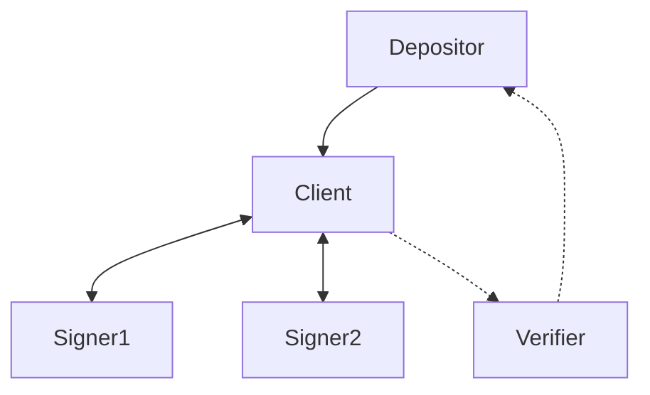

# Outsourcing ephemeral signatures with blinded MuSig2

## Introduction
A well-known construction that is possible on Bitcoin today is vaults using
pre-signed transactions[1]. The construction relies on using ephemeral keys to
sign a predetermined transaction graph, before deleting the keys. However, as
detailed in [2], the setup is brittle and presents several complexities. The
most important drawback is that key deletion cannot be proved, and one is
susceptible to malicious software or hardware leaking the ephemeral key. Ways
to mitigate this problem has been devised, but they often involve complex and
expensive infrastructure, hardware and software[citation].

A second drawback is that the amount to deposit to a pre-signed vault is static,
and one risk money getting stuck if the deposit transaction is not exactly as
assumed, or the vault address is reused.

In this post we aim to mitigate these two problems in using pre-signed
transaction graphs, by outsourcing the ephemeral signing to semi-trusted
signing servers, eliminating any single points of failure by having them engage
in a blinded multi-signature scheme. 

PSBTs play a key role in ensuring the correcteness of the deposit transaction,
ensuring that the scheme is practically usable without introducing complex
software requirements at the depositor.

## Setup
The protocol will involve these actors:
- **Depositor**: the software or hardware entity controlling the keys to the coins
  that are to be deposited into the pre-signed transaction graph. 
- **Client**: the aggregation software that is responsible for building the
  transaction graph, communicating with the signers and deriving blinding
  factors.
- **Signer**: Semi-trusted software agent that will blindly sign a single message
  sent by the client using an ephemeral key. It also has a well-known static
  public key, that will be used to attest to having followed the protocol
  according to the rules.
- **Verifier**: Offline device that will verify the transcript of the protocol,
  ensuring the transaction graph and signatures are valid, and that the
  messages signed are attestated by the signers' well-known keys.

## High-level protocol overview
With a blinded signing scheme in place we can build a safe and practical vault
implementation by passing PSBTs around.

1. The depositor creates a PSBT specifying inputs for the deposit transaction,
   as well as the amount for the vault output and any change outputs.

2. The PSBT is sent to the client which sets up signing sessions with the
   signers.

3. Using the ephemeral public keys of the signers, the client creates the
   aggregate public key that funds will be sent to. 

4. The client builds the transaction that will spend from the aggragate public
   key. Note that it will recursively open more signing session with the
   signers to build the full transaction graph, since each key is good for only
   a single signature.

5. With the transaction created, the client sends a blinded variant of it to
   the signers.

6. Each signer will respond with a single signature with the ephemeral key, as
   well as an attestation to the received blinded information using their
   static key.

7. The verifier is given the information from the signing process from the
   client, verifying that all went according to the protocol.

8. The depositor receives the final PSBT with the vault output key
   filled, and a goahead from the verifiers, promting it to sign and broadcast
   the deposit.

## Goals
Our aim is to set up the protocol with the following goals in mind:

1. As long as at least one of the signers are following the protocol, the other
   actors in the setup cannot collaborate to create valid signatures for any
   other transactions spending from the vaulted output.
2. Malicious client software cannot choose parameters in a way that makes it
   possible to create additional signatures or build transaction graphs unknown
   to the verifier.
3. As long as one of the verifiers are honest, we will detect a misbehaving
   client and abort the protocol before depositing funds.
4. The signer won't learn anything about the transactions they are signing, how
   many other signers there are, nor anything about their individual public
   keys or aggregate public key.

# Blinded multi-signature protocol

### Notes on blinded MuSig in the general, non-ephemeral setting 
An open reserch question is whether blinded MuSig1 and MuSig2 can be secure in
a concurrent setting, where a signer potentially can sign multiple messages in
parallel using the same key [citation].

However, in our setup the key and nonces are derived uniformly at random during
protocol initialisation, and deleted immediately after a single signature has
been made. This makes the protocol significantly easier to analyze.

## Naive Blinded Schnorr
We'll first lay out a naive blinded schnorr multisig scheme that would work in
practice, but is unsafe if agents start misbehaving. We'll use this as a
fundament to build the safe version of the protocol.

We'll have two signers take part, but it could easily be generalized to $N$
signers.

The client ask the two signers to generate keys and nonces.

Signers create keys $X_1 = x_1 * G$ and $X_2 = x_2 * G$, and nonces 
$R_1 = r_1 * G$ and $R_2 = r_2 * G$. The public values are sent to the client.

Client generates blinding values $\alpha_1, \beta_1, \alpha_2, \beta_2$, and
calculates blinded nonces:

$$
R'_1 = R_1 + \alpha_1 * G + \beta_1 * X_1 \\
R'_2 = R_2 + \alpha_2 * G + \beta_2 * X_1 \\
R' = R'_1 + R'_2
$$

Client sets aggregate public key to $X = X_1 + X_2$. 

Message to sign is $e = H(R', X, tx)$, where $tx$ is the sighash for the
transaction to sign.

Client then asks signers to sign blinded message $e'_1 = e + \beta_1$ and $e'_2
= e + \beta_2$ respectively.

Signers sign 

$$
s'_1 = r_1 + e'_1 * x_1 = r_1 + e * x_1 + \beta_1 * x_1 \\
s'_2 = r_2 + e'_2 * x_2 = r_2 + e * x_2 + \beta_2 * x_2
$$

Client unblinds signatures 

$$
s_1 = s'_1 + \alpha_1 = (r_1 + e * x_1 + \beta_1 * x_1) + \alpha_1 = (r_1 + \alpha_1 + \beta_1 * x_1) + e * x_1 \\
s_2 = s'_2 + \alpha_2 = (r_2 + e * x_2 + \beta_2 * x_2) + \alpha_2 = (r_2 + \alpha_2 + \beta_2 * x_2) + e * x_2
$$

The final signature will be $(R', s_1 + s_2)$.

Signature verification:

$$
\begin{aligned}
s_1 * G &= r_1 * G + \alpha_1 * G + \beta_1 * x_1 * G + e * x_1 * G \\
    &= (R_1 + \alpha_1 * G + \beta_1 * X_1) + e * X_1 \\
    &= R'_1 + e * X_1
\end{aligned}
$$

$$
\begin{aligned}
s &= s_1 + s_2 \\
s * G &= (R'_1 + e * X_1) + (R'_2 + e * X_2) \\
    &= R' + e * (X_1 + X_2) \\
    &= R' + e * X \\
\end{aligned}
$$

Which is a valid signature with key $X$ for the message.

However, this naive scheme is vulnerable to a key cancellation attack if
signers are learning each others' keys (for instance if a malicious client
software forwards keys to the other signer). This cannot be detected by an
independent verifier and we don't meet our goals for the protocol:

Signer sets $X_1 = X'_1 - X_2$, and can therefore create signatures for the
aggregate key $X = X_1 + X_2 = X'_1 - X_2 + X_2 = X'_1$

## MuSig and MuSig2
To combat the key cancellation attack the naive scheme is vulnerable to, the
MuSig and MuSig2 protocals were created.

The MuSig family of multisignature protocols deals with key cancellation by
making sure a non-constant factor is added to each signer's public key, that is
dependent on all other keys. This means that a malicious signer cannot know the
aggregate public key before revealing their own key, since their key will add a
random factor to all other keys (by hashing the key-set). 

Even if all but one signer is malicious, one cannot choose keys without
violating the non-constant factors added to the final key. This means that an
honest verifier will catch a rouge key by seeing that the factors don't match.
Since the factor is a hash involving the honest signer key (essentilly a random
value), there's infeasible to choose a rouge key to make the equation go up.

MuSig also have each signer commit to their nonce, so they cannot change it
after the first round. This is to deal with certain types of nonce grinding
attacks.

MuSig2 is similar, but avoids needing to commit to the nonce by also having
each signer's final nonce be dependent on every other signer's nonce (again by
hashing them).

The problem with using the MuSig schemes directly for our problem, is that in 
order for them to be secure, each signer have to calculate the non-constant 
factor added to the key. This factor is dependent on every other signer's key, 
which means the signer will learn who they are (or at least how many signers 
there are).

Instead we need to move this check to the verification software, that will
check that the terms and aggregate keys are calculated properly. In other words
signers can proceed as in the normal algorithm, but cannot verify everything.
This is now done by the verifiers, which can abort the protocol before funds
are deposited.

We believe that since the signers only craft a single signature for each key and
nonce, MuSig1 would be safe to use as a foundation for the protocol.  But we
will opt to base our scheme on MuSig2, since the commitments to the nonce in
MuSig1 cannot be checked by the verifier until the signature has been created,
making analysis harder (the signers cannot check the commitments as in regular
MuSig1, since that would teach them about other signers in the signing
session). 

For MuSig2 the verifiers can check that the nonces were derived correctly
after the fact, since the aggregate nonce depends on a hash of the honest
signer's two nonces.

## Ephemeral signing using MuSig2
Let's look at how an ephemeral signing scheme would work with regular MuSig2,
without blinding it. Again we'll assume two signers, without loss of
generality.

The client asks the signers for keys and nonces.

The signers choose two nonces each $R^1_1 = r^1_1 * G$ and $R^2_1 = r^2_1 * G$. Public
keys are $X_1 = x_1 * G$ and $X_2 = x_2 * G$.

The client uses all the signers' public values to generate the MuSig2 factors
that each signer would create in the regular MuSig2 protocol:

$$
l = H(X_1|X_2) \\
c_1 = H(l|X_1) \\
X'_1 = c_1 * X_1
$$

Aggregate public key: 

$$
X' = X'_1 + X'_2
$$

Aggregate nonces:

$$
R^1 = R^1_1 + R^1_2 \\
R^2 = R^2_1 + R^2_2
$$

Nonce blinder:

$$
b = H(R^1, R^2, X', tx)
$$

Signing nonce:

$$
R = R^1 + b * R^2 
$$

Message:

$$
e = H(R, X', msg)
$$

Given $b$, $e$ and $c_i$, the signers can now sign:

$$
s_1 = r^1_1 + b * r^2_1 + e * c_1 * x_1 \\
s_2 = r^1_2 + b * r^2_2 + e * c_2 * x_2
$$

Aggregate signature:

$$
\begin{aligned}
s   &= s_1 + s_2 \\
    &= (r^1_1 + r^1_2) + b * (r^2_1 + r^2_2) + e * (c_1 * x_1 + c_2 * x_2)
\end{aligned}
$$

Signature check:

$$
\begin{aligned}
s*G &= (r^1_1 + r^1_2) * G + b * (r^2_1 + r^2_2) * G + e * (c_1 * x_1 + c_2 * x_2) * G \\
    &= R^1 + b * R^2 + e * (X'_1 + X'_2) \\
    &= R + e * X'
\end{aligned}
$$

making $(R, s)$ a valid signature for the message with key $X'$.

### Meeting our goals
Let's see if the scheme devised meets our original goals:
1. This follows from MuSig2. We can only craft a valid signature for the
   combined key if all signers sign according to protocol.
2. Follows from MuSig2. The verifier can act as any of the signers in MuSig2,
   verifying that the parameters are build correctly from the public
   information.
3. Verifier can check all steps performed by client, and check it matches the
   parameters attested by the signers.
4. Not met.

## Ephemeral blinded signing MuSig2
We'll introduce blinding to the MuSig2 scheme in order to avoid the signers
learning anything about the setup, and meet all our goals. The crucial insight
here in order to make the scheme safe, is that we do have an honest verifier at
hand, that will make sure the blinding procedure won't introduce ways to cheat.
Think of it this way: the addition of blinding factors make it impossible for
the signers to check that they are signing using the correct values, so we
instead move this validation to the verifier. The verifier knows the blinding
values and can be the eyes and ears of the signers into this closed envelope.

The client asks the signers for keys and nonces.

The signers choose two nonces each $R^1_1 = r^1_1 * G$ and $R^2_1 = r^2_1 * G$. Public
keys are $X_1 = x_1 * G$ and $X_2 = x_2 * G$.

The client uses all the signers' public values to generate the MuSig2 factors
that each signer would create in the regular MuSig2 protocol:

$$
\begin{aligned}
l = H(X_1|X_2) \\
c_1 = H(l|X_1) \\
X'_1 = c_1 * X_1
\end{aligned}
$$

Aggregate public key: 

$$
X' = X'_1 + X'_2
$$

Aggregate nonces:

$$
R^1 = R^1_1 + R^1_2 \\
R^2 = R^2_1 + R^2_2
$$

Nonce blinder:

$$
b = H(R^1, R^2, X', tx)
$$

Signing nonce:

$$
R = R^1 + b * R^2 
$$

Client generates blinding values $\alpha_1, \beta_1, \alpha_2, \beta_2$, and
calculates blinded nonces:

$$
R' = R + (\alpha_1 + \alpha_2) * G + (\beta_1 * c_1 * X_1) + (\beta_2 * c_2 * X_2)
$$

Message:

$$
e = H(R', X', tx)
$$

Blinded message:

$$
e_1 = e + \beta_1 \\
e_2 = e + \beta_2 
$$

$b$, $c_1$ and $e_1$ is sent to signer 1.

$b$, $c_2$ and $e_2$ is sent to signer 2.

Signers can now sign:

$$
\begin{aligned}
s'_1 &= r^1_1 + b * r^2_1 + e_1 * c_1 * x_1 \\
    &= r^1_1 + b * r^2_1 + e * c_1 * x_1 + \beta_1 * c_1 * x_1\\
s'_2 &= r^1_2 + b * r^2_2 + e_2 * c_2 * x_2 \\
    &= r^1_2 + b * r^2_2 + e * c_2 * x_2 + \beta_2 * c_2 * x_2
\end{aligned}
$$

In addition we have each signer sign their public values and the values
received from the client using their static key $P$. They will delete the
ephemeral private keys after signing.

Client unblinds every partial signature:

$$
\begin{aligned}
s_1 = s'_1 + \alpha_1 \\
s_2 = s'_2 + \alpha_2
\end{aligned}
$$

Aggregate signature:

$$
\begin{aligned}
s   &= s_1 + s_2 \\
s   &= s'_1 + \alpha_1 + s'_2 + \alpha_2 \\
    &= (r^1_1 + b * r^2_1 + e * c_1 * x_1 + \beta_1 * c_1 * x_1) + \alpha_1 + (r^1_2 + b * r^2_2 + e * c_2 * x_2 + \beta_2 * c_2 * x_2) + \alpha_2 \\
    &= (r^1_1 + r^1_2) + b * (r^2_1 + r^2_2) + e * (c_1 * x_1 + c_2 * x_2)  + \beta_1 * c_1 * x_1 + \beta_2 * c_2 * x_2 + \alpha_1 + \alpha_2 \\
\end{aligned}
$$

Signature check:

$$
\begin{aligned}
s*G &= (r^1_1 + r^1_2) * G + b * (r^2_1 + r^2_2) * G + e * (c_1 * x_1 + c_2 * x_2) * G + \beta_1 * c_1 * x_1 * G + \beta_2 * c_2 * x_2 *G + \alpha_1 *G  + \alpha_2 * G \\
    &= (R^1_1 + R^1_2) + b * (R^2_1 + R^2_2) + e * (c_1 * X_1 + c_2 * X_2) + \beta_1 * c_1 * X_1 + \beta_2 * c_2 * X_2 + \alpha_1 *G  + \alpha_2 * G \\
    &= R + (\alpha_1 + \alpha_2) * G + (\beta_1 * c_1 * X_1) + (\beta_2 * c_2 * X_2) + e * (X'_1 + X'_2) \\
    &= R' + e * X' \\
\end{aligned}
$$

making $(R', s)$ a valid signature for aggregate key $X'$.

The verifier then checks that all values check out. In particular, they check
that the blinded values used by the signers (that they received from the
client) are signed by each signer's static key.

### Meeting our goals
1. As in the non-blinded version, without access to all private keys, no
   additional signatures can be crafted.

2. Unlike regular MuSig2, the signers cannot check the validity of the message,
   nonce and combined key they are using, since they are blinded. However, we
   assumed that the protocol is checked by at least one honest verifier, which
   will take the role of each signer in validating the parameters. The verifier
   can check that the parameters $b$, $c_i$, $e_i$ derived using sane values,
   and abort the protocol otherwise. It will also check that he final signature
   is signing the transaction graph we expect.

3. The verifier can check that all values are being derived correctly, and
   cross-check the used values with the signatures signed by each signer's
   static key.  The one thing the verifier cannot know for sure is whether the
   client is choosing the blinding factors uniformly at random. If it is not,
   the security will degrade back to non-blinded Musig2, which is still secure,
   but less private. This is okay, the client software could still leak all
   this information, and privacy from malicious client is not part of our
   requirements.

4. The only information the signers receive from the client is $b$, $c_i$ and
   $e_i$. $b$ and $c_i$ are hashes of information unknown to each individual
   signer, meaning they are essentially random values. They could learn the
   preimage to these hashes, but that would require either all other signers or
   the client misbehaving. $e_i$ is blinded.

## Ephemeral blinded signing using simplified MuSig2
We base our scheme on musig2, but we can simplify it quite a bit since we are
not reusing keys, and we are in a sequential setting.

The client asks the signers for keys and nonces.

The signers choose one nonce each $R_1 = r_1 * G$ and $R_2 = r_2 * G$. Public
keys are $X_1 = x_1 * G$ and $X_2 = x_2 * G$.

The client uses all the signers' public values to generate the MuSig2 factors
that each signer would create in the regular MuSig2 protocol:

$$
\begin{aligned}
l = H(X_1|X_2) \\
c_1 = H(l|X_1) \\
X'_1 = c_1 * X_1
\end{aligned}
$$

Aggregate public key: 

$$
X' = X'_1 + X'_2
$$

Aggregate nonce:

$$
R = R_1 + R_2 \\
$$

Note that we only need a single nonce per signer, since we are operating in a
sequential setting.

Client generates blinding values $\alpha_1, \beta_1, \alpha_2, \beta_2$, and
calculates blinded signing nonce:

$$
R' = R + (\alpha_1 + \alpha_2) * G + (\beta_1 * c_1 * X_1) + (\beta_2 * c_2 * X_2)
$$

The message that will ultimately be signed is:

$$
e = H(R', X', tx)
$$

We now blind the message for each signer, to ensure they don't learn anything
about the transaction they are signing::

$e_1 = e + \beta_1$ and $e_2 = e + \beta_2$.

$c_1 * e_1$ is sent to signer 1.

$c_2 * e_2$ is sent to signer 2.

TODO: safe to send $c_1 * e_1$ only? Verifier must be able to check that the
signer is not signing using a rougue key. Attack scenario: client and a signer
conspires to choose a rogue key. They do this by using a $c_1$ not derived from
the other keys. But this will be caught by the verifier, since it will see that
the aggregate public key doesn't check out.

Signers can now sign:

$$
\begin{aligned}
s'_1 &= r_1 + e_1 * c_1 * x_1 \\
    &= r_1 + e * c_1 * x_1 + \beta_1 * c_1 * x_1\\
s'_2 &= r_2 + + e_2 * c_2 * x_2 \\
    &= r_2 + e * c_2 * x_2 + \beta_2 * c_2 * x_2
\end{aligned}
$$

In addition we have each signer sign their public values and the values
received from the client using their static key $P$. They will delete the
ephemeral private keys after signing.

Client unblinds every partial signature:

$$
\begin{aligned}
s_1 = s'_1 + \alpha_1 \\
s_2 = s'_2 + \alpha_2
\end{aligned}
$$

Aggregate signature:

$$
\begin{aligned}
s   &= s_1 + s_2 \\
s   &= s'_1 + \alpha_1 + s'_2 + \alpha_2 \\
    &= (r_1 + e * c_1 * x_1 + \beta_1 * c_1 * x_1) + \alpha_1 + (r_2 + e * c_2 * x_2 + \beta_2 * c_2 * x_2) + \alpha_2 \\
    &= (r_1 + r_2) + e * (c_1 * x_1 + c_2 * x_2)  + \beta_1 * c_1 * x_1 + \beta_2 * c_2 * x_2 + \alpha_1 + \alpha_2 \\
\end{aligned}
$$

Signature check:

$$
\begin{aligned}
s*G &= (r_1 + r_2) * G + e * (c_1 * x_1 + c_2 * x_2) * G + \beta_1 * c_1 * x_1 * G + \beta_2 * c_2 * x_2 *G + \alpha_1 *G  + \alpha_2 * G \\
    &= (R_1 + R_2) + e * (c_1 * X_1 + c_2 * X_2) + \beta_1 * c_1 * X_1 + \beta_2 * c_2 * X_2 + \alpha_1 *G  + \alpha_2 * G \\
    &= R + (\alpha_1 + \alpha_2) * G + (\beta_1 * c_1 * X_1) + (\beta_2 * c_2 * X_2) + e * (X'_1 + X'_2) \\
    &= R' + e * X' \\
\end{aligned}
$$

making $(R', s)$ a valid signature for aggregate key $X'$.

The verifier then checks that all values check out. In particular, they check
that the blinded values used by the signers (that they received from the
client) are signed by each signer's static key.

TODO: more details about what the verifier is doing here.

### Meeting our goals
1. As in the non-blinded version, without access to all private keys, no
   additional signatures can be crafted.

2. Unlike regular MuSig2, the signers cannot check the validity of the message,
   nonce and combined key they are using, since they are blinded. However, we
   assumed that the protocol is checked by at least one honest verifier, which
   will take the role of each signer in validating the parameters. The verifier
   can check that the parameters $b$, $c_i$, $e_i$ derived using sane values,
   and abort the protocol otherwise. It will also check that he final signature
   is signing the transaction graph we expect.

3. The verifier can check that all values are being derived correctly, and
   cross-check the used values with the signatures signed by each signer's
   static key.  The one thing the verifier cannot know for sure is whether the
   client is choosing the blinding factors uniformly at random. If it is not,
   the security will degrade back to non-blinded Musig2, which is still secure,
   but less private. This is okay, the client software could still leak all
   this information, and privacy from malicious client is not part of our
   requirements.

4. The only information the signers receive from the client is $b$, $c_i$ and
   $e_i$. $b$ and $c_i$ are hashes of information unknown to each individual
   signer, meaning they are essentially random values. They could learn the
   preimage to these hashes, but that would require either all other signers or
   the client misbehaving. $e_i$ is blinded.

### References
- [1] https://lists.linuxfoundation.org/pipermail/bitcoin-dev/2019-August/017229.html
- [2] https://jameso.be/vaults.pdf
- https://lists.linuxfoundation.org/pipermail/bitcoin-dev/2023-July/021792.html
- https://github.com/commerceblock/mercury/blob/master/doc/blind_musig2.md
- https://gist.github.com/nickfarrow/4be776782bce0c12cca523cbc203fb9d
- https://gist.github.com/moonsettler/05f5948291ba8dba63a3985b786233bb
- https://eprint.iacr.org/2020/1071.pdf

